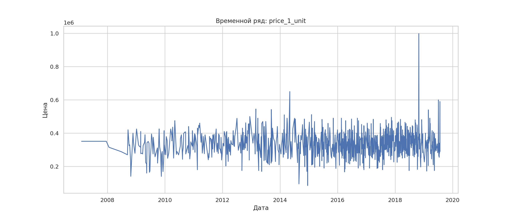
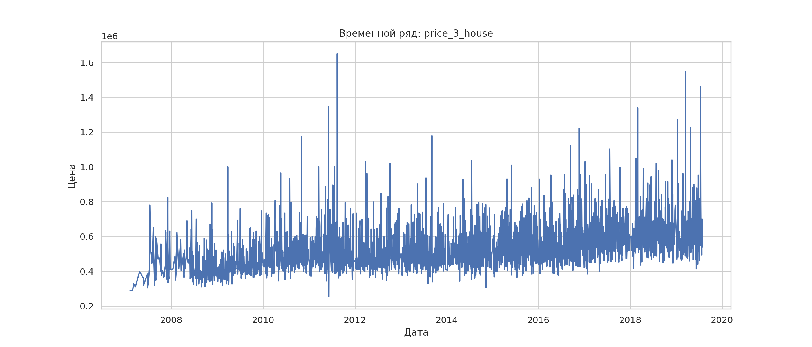
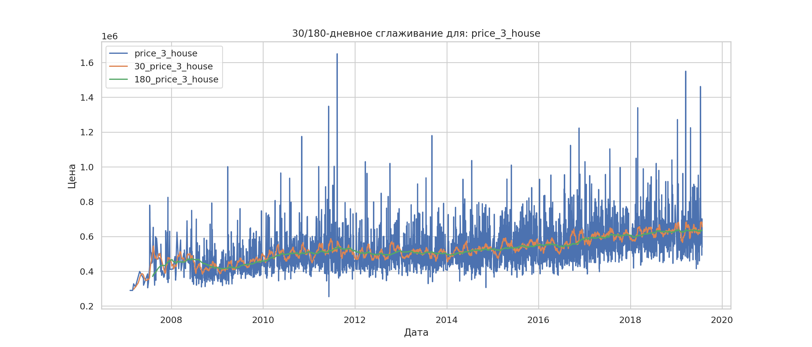
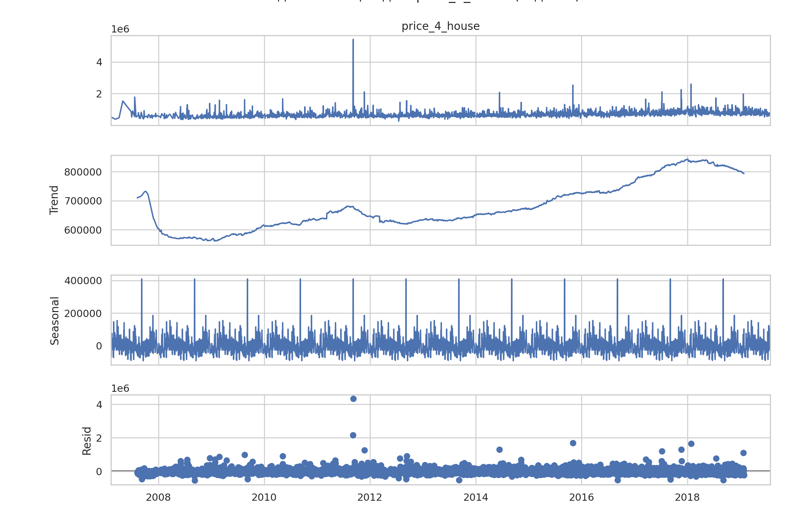
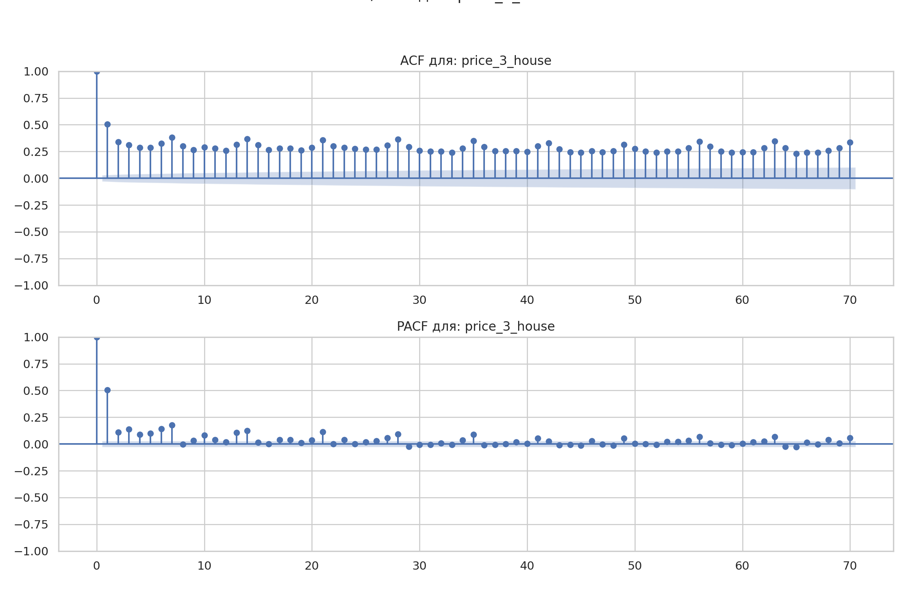
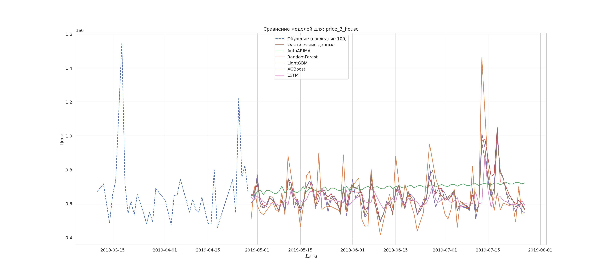
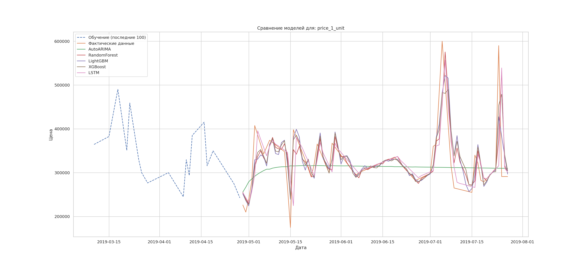

# house_sales_prediction

**Цели проекта**
- Подготовить и агрегировать данные и выявить тренды, сезонность и нестационарность цен;
- Построить и сравнить несколько моделей прогнозирования, после чего выявить лучшую.

**Основные задачи:**
- Подготовка и предобработка данных;
- Исследовательский анализ данных;
- Анализ сезонности;
- Проверка данных на стационарность и поиск закономерностей;
- Подготовка к построению моделей прогнозирования;
- Сравнение моделей.

Все артефакты проекта сохраняются в папках  
[`images/`](images/), [`models/`](models/) и [`results/`](results/).

Переход к [**Ноутбуку**](house_sales_prediction.ipynb)

---

## Используемые библиотеки
`pandas`, `numpy`, `matplotlib`, `seaborn`,  
`statsmodels`, `pmdarima`,  
`scikit-learn`, `xgboost`, `lightgbm`,  
`tensorflow (Keras)`, `joblib`

---

## 1. Подготовка и предобработка данных
- Источник: [**House Sales**](data/README.md)

**Основные признаки:**
- `datesold` — дата продажи;
- `price` — цена продажи (AUD);
- `propertyType` — тип недвижимости (`house`, `unit`);
- `bedrooms` — количество спален.
- 
**Шаги предобработки:**
- удалён признак `postcode`;
- проверены пропуски и типы данных;
- данные агрегированы в  временные ряды по комбинациям - тип недвижимости и количество спален;
- отобраны комбинации с ≥ 500 наблюдений;
- пропуски заполнены интерполяцией по времени.

[`Характеристики получнных временных рядов`](results/all_ts_results_df.csv)
| № | Ряд           | Длина полного ряда | Длина ряда с данными | Начало периода | Конец периода | Количество пропусков |
|---|---------------|--------------------|----------------------|----------------|---------------|----------------------|
| 0 | price_1_unit  | 4554               | 1041                 | 2007-02-07     | 2019-07-27    | 3513                 |
| 1 | price_2_house | 4554               | 697                  | 2007-02-07     | 2019-07-27    | 3857                 |
| 2 | price_2_unit  | 4554               | 1607                 | 2007-02-07     | 2019-07-27    | 2947                 |
| 3 | price_3_house | 4554               | 3121                 | 2007-02-07     | 2019-07-27    | 1433                 |
| 4 | price_3_unit  | 4554               | 570                  | 2007-02-07     | 2019-07-27    | 3984                 |
| 5 | price_4_house | 4554               | 3055                 | 2007-02-07     | 2019-07-27    | 1499                 |
| 6 | price_5_house | 4554               | 1338                 | 2007-02-07     | 2019-07-27    | 3216                 |

Итоговый датасет:  
[`Первые 5 строк датасета после интерполяции`](results/all_ts_df_daily_interpolated.csv)
|  | datesold   | price_1_unit | price_2_house | price_2_unit | price_3_house | price_3_unit | price_4_house | price_5_house |
|---|------------|--------------|---------------|--------------|---------------|--------------|---------------|---------------|
| 0 | 2007-02-07 | 351000.0     | 325000.0      | 300000.0     | 290000.0      | 480000.0     | 525000.0      | 800000.0      |
| 1 | 2007-02-08 | 351000.0     | 325000.0      | 300000.0     | 290000.0      | 480000.0     | 520166.67     | 800000.0      |
| 2 | 2007-02-09 | 351000.0     | 325000.0      | 300000.0     | 290000.0      | 480000.0     | 515333.33     | 800000.0      |
| 3 | 2007-02-10 | 351000.0     | 325000.0      | 300000.0     | 290000.0      | 480000.0     | 510500.0      | 800000.0      |
| 4 | 2007-02-11 | 351000.0     | 325000.0      | 300000.0     | 290000.0      | 480000.0     | 505666.67     | 800000.0      |

Для каждого сегмента построен отдельный временной ряд (приведены примеры price_1_unit и price_3_house).

**Наблюдения:**
- выраженный рост цен во времени;
- плотность наблюдений увеличивается к концу периода.

---

## 3. EDA: тренды и сезонность

**Скользящие средние (30 и 180 дней)**

График для price_3_house:

- долгосрочный восходящий тренд устойчив для всех рядов.

**Сезонная декомпозиция (годовая)**

График для price_4_house:

**Выводы:**
- присутствует сезонность;
- тренд наиболее плавный у сегментов с большим объёмом данных
  (дома с 3–4 спальнями).

**Проверка стационарности**

Использованы тесты:
- ADF
- KPSS

[`Результаты тестов стационарности`](results/stationarity_results.csv)
| № | Series        | ADF_p_value | ADF_Stationary | KPSS_p_value | KPSS_Stationary |
|---|---------------|-------------|----------------|--------------|-----------------|
| 0 | price_1_unit  | 4.06e-21    | True           | 6.75e-02     | True            |
| 1 | price_2_house | 1.74e-20    | True           | 1.00e-02     | False           |
| 2 | price_2_unit  | 5.74e-20    | True           | 1.00e-02     | False           |
| 3 | price_3_house | 2.13e-04    | True           | 1.00e-02     | False           |
| 4 | price_3_unit  | 1.70e-18    | True           | 1.00e-02     | False           |
| 5 | price_4_house | 4.52e-09    | True           | 1.00e-02     | False           |
| 6 | price_5_house | 1.66e-20    | True           | 1.00e-02     | False           |

Тесты стационарности говорят о том, что price_1_unit - стационарный ряд, все остальные временные серии не стационарны.

**ACF / PACF**

График для price_3_house:

- Функция медленное убывает, что говорит о нестационарности;
- сильная зависимость от лагов 1–3 дней;
- для некоторых рядов заметна недельная сезонность (лаг 7).

---

## 4. Подготовка признаков

Для моделей машинного обучения сформированы признаки:
- лаги: `1, 2, 3, 7, 14, 30, 90, 180, 365`;
- экспоненциальные скользящие средние: `EMA(10, 30, 60)`.

Горизонт прогнозирования: **90 дней**.

---

## 5. Модели прогнозирования

В проекте обучены и сравнены 5 моделей:

1. **AutoARIMA** (сезонная, `m=7`);
2. **RandomForest Regressor**;
3. **LightGBM Regressor**;
4. **XGBoost Regressor**;
5. **LSTM (Keras)**.

---

## 7. Сравнение моделей

Оценка проводилась по метрикам:
- **RMSE**
- **MAE**
- **MAPE%**

  
[`Полная таблица метрик:`](results/all_model_metrics.csv)
| Series        | Model        | RMSE      | MAE       | MAPE% |
|---------------|--------------|-----------|-----------|-------|
| price_1_unit  | LightGBM     | 39577.48  | 24686.79  | 7.48  |
| price_1_unit  | XGBoost      | 41544.61  | 24644.89  | 7.65  |
| price_1_unit  | RandomForest | 49065.2   | 25899.53  | 7.69  |
| price_1_unit  | LSTM         | 55245.71  | 26253.46  | 7.71  |
| price_1_unit  | AutoARIMA    | 64114.72  | 40025.57  | 11.58 |
| price_2_house | XGBoost      | 47809.28  | 27421.58  | 5.62  |
| price_2_house | RandomForest | 59231.33  | 29332.85  | 5.71  |
| price_2_house | LightGBM     | 49210.92  | 29376.96  | 6.1   |
| price_2_house | LSTM         | 64514.72  | 35825.02  | 7.25  |
| price_2_house | AutoARIMA    | 129938.32 | 107236.35 | 25.1  |
| price_2_unit  | LightGBM     | 53925.45  | 39065.13  | 8.77  |
| price_2_unit  | XGBoost      | 58503.83  | 41143.58  | 9.01  |
| price_2_unit  | RandomForest | 62749.61  | 42265.22  | 9.29  |
| price_2_unit  | LSTM         | 68776.01  | 46043.2   | 9.92  |
| price_2_unit  | AutoARIMA    | 132183.41 | 94843.46  | 18.41 |
| price_3_house | XGBoost      | 108102.38 | 74787.43  | 11.27 |
| price_3_house | LightGBM     | 108010.81 | 78241.51  | 11.76 |
| price_3_house | RandomForest | 111442.65 | 80781.05  | 12.37 |
| price_3_house | LSTM         | 146126.41 | 94544.39  | 13.7  |
| price_3_house | AutoARIMA    | 161747.03 | 129971.84 | 21.23 |
| price_3_unit  | RandomForest | 31619.84  | 18072.81  | 3.21  |
| price_3_unit  | XGBoost      | 32936.16  | 20352.27  | 3.48  |
| price_3_unit  | LSTM         | 33297.61  | 21410.97  | 3.75  |
| price_3_unit  | LightGBM     | 36730.29  | 23583.72  | 4.06  |
| price_3_unit  | AutoARIMA    | 168739.82 | 155755.32 | 28.93 |
| price_4_house | XGBoost      | 63586.85  | 49726.91  | 6.74  |
| price_4_house | LightGBM     | 62961.35  | 50067.05  | 6.78  |
| price_4_house | RandomForest | 68824.14  | 54401.07  | 7.32  |
| price_4_house | LSTM         | 102407.67 | 84686.79  | 11.95 |
| price_4_house | AutoARIMA    | 147155.94 | 125230.85 | 18.17 |
| price_5_house | XGBoost      | 204912.94 | 102690.23 | 9.22  |
| price_5_house | LightGBM     | 216807.17 | 95904.11  | 9.77  |
| price_5_house | RandomForest | 210476.37 | 102914.86 | 9.77  |
| price_5_house | LSTM         | 218515.5  | 115941.45 | 10.68 |
| price_5_house | AutoARIMA    | 404891.88 | 247424.12 | 21.13 |

Времы обучения моделей:

- LightGBM — 13.44 секунды;
- XGBoost — 21.09 секунды;
- RandomForest — 4.17 минуты;
- LSTM — 25.60 минуты;
- AutoARIMA — 79.43 минуты.

Лучшая модель по сегментам:

- `price_1_unit` → **LightGBM**
- `price_2_house` → **XGBoost**
- `price_2_unit` → **LightGBM**
- `price_3_house` → **XGBoost**
- `price_3_unit` → **RandomForest**
- `price_4_house` → **XGBoost**
- `price_5_house` → **LSTM**

Для прогнозирования цен на недвижимость наиболее эффективными оказались ансамблевые модели градиентного бустинга (LightGBM, XGBoost).

---

## 7. Визуализация прогнозов

Сравнение фактических значений и прогнозов всех моделей:

**Общие наблюдения:**
- модели ML и DL лучше улавливают тренды и пики;
- AutoARIMA даёт более сглаженные, но менее точные прогнозы;
- LightGBM и XGBoost показывают очень схожие и стабильные результаты;
- LSTM лучше справляется с длинными и более сложными рядами.

---

## 8. Итоговые выводы

1. Временные ряды цен на недвижимость:
   - по большей части нестационарны;
   - имеют выраженный восходящий тренд и сезонность.
2. Классическая AutoARIMA уступает моделям ML/DL из-за:
   - нелинейной динамики;
   - сложных долгосрочных зависимостей.
3. **Градиентный бустинг (XGBoost, LightGBM)** показал:
   - наилучшее соотношение точности и скорости обучения;
   - стабильные результаты на большинстве сегментов.
4. **LSTM** эффективна для длинных рядов, но:
   - требует больше времени и ресурсов;
   - чувствительна к настройкам и данным.
5. **XGBoost** можно рекомендовать как универсальную модель
   для прогнозирования цен на недвижимость в данном проекте.

 Проект демонстрирует, что современные ансамблевые и нейросетевые модели значительно превосходят классические подходы при анализе и прогнозировании сложных временных рядов.
